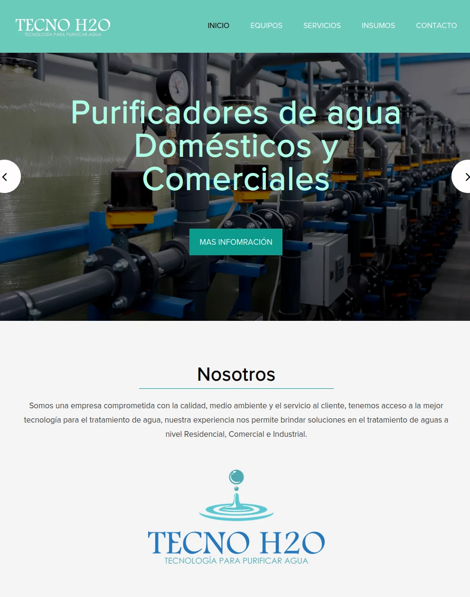

# Tecno H2O Business Website
Business Website made for water purifying retailer.

**Link to project:** https://tecnoh2o.com.mx/

## How It's Made:

**Tech used:** HTML, CSS, JavaScript 

Spoke with client to understand their needs. Implemented a styling which reflected approachability and formality at the same time. Added social media and e-Commerce pointers so that a user can easily access all of the information and media from the company. 

## Optimizations

Would like to code a better layout for mobile users and especially dark mode users, as site looks best when light mode is on. As site is mostly white, when in dark mode the aesthetics of the site break, but perhaps coding another design for dark-mode could help.

## Lessons Learned:

Learned about water filtering and what the process entails. Moreover, learned to make dynamic social media buttons.

## Examples:
Take a look at these couple examples that I have in my own portfolio:

**GREDSA Business Website:** https://github.com/Arikabz/GREDSA

**ListApp FullStack App:** https://github.com/Arikabz/ListAppV1.0

**Portfolio Website:** https://github.com/Arikabz/Lucero

